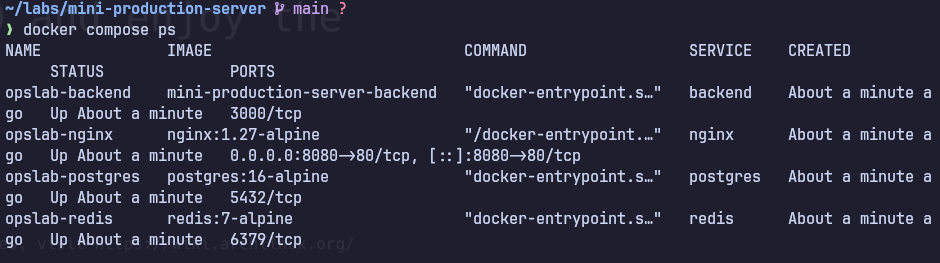
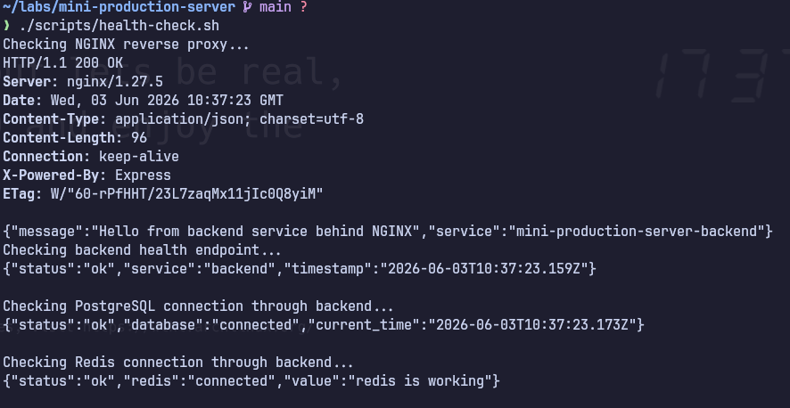
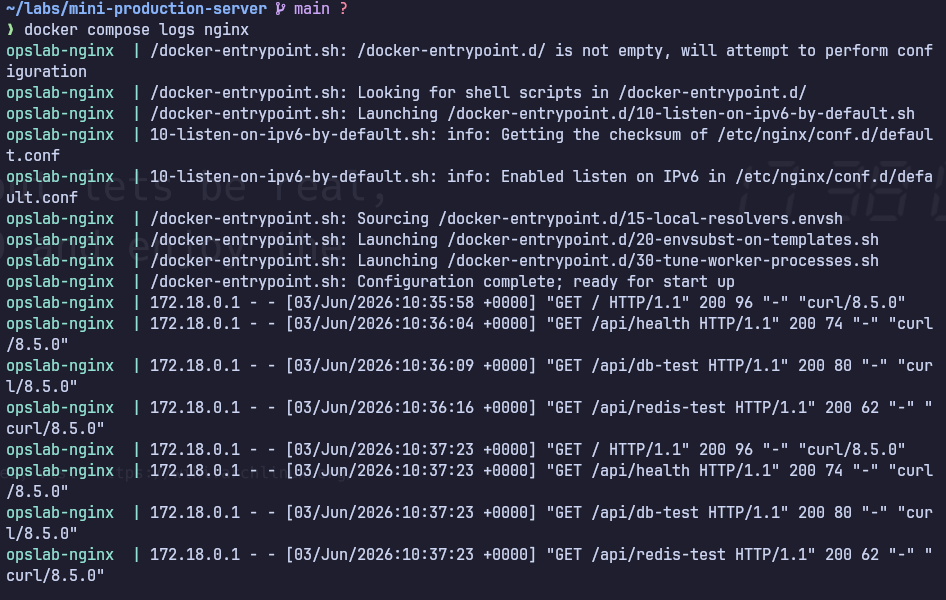
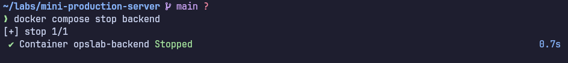
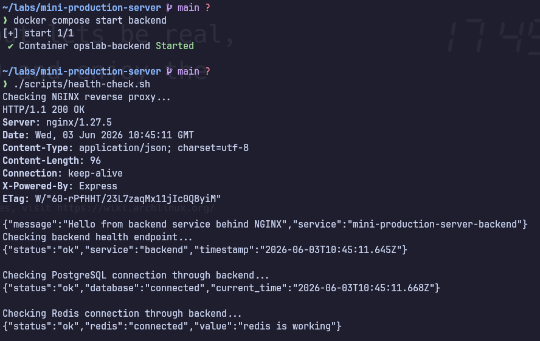
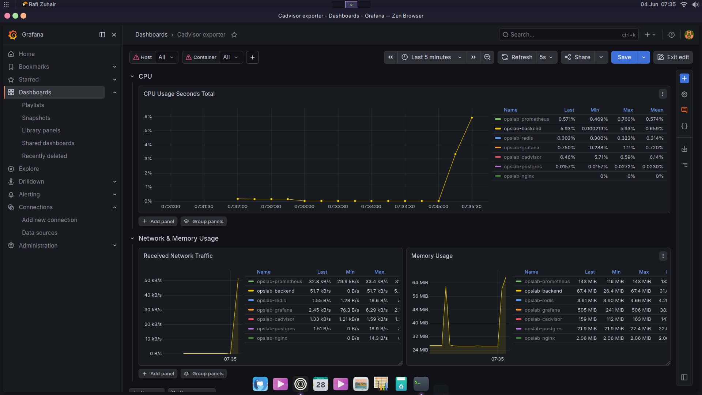

# Mini Production Server Lab

A production-like infrastructure lab built using Docker Compose, NGINX, Node.js, PostgreSQL, Redis, Prometheus, Grafana, and cAdvisor.

This project was created to practice core IT Operations, Infrastructure, and Platform Engineering concepts including reverse proxy configuration, container networking, service monitoring, health validation, troubleshooting, and incident simulation.

---

## Objectives

This lab focuses on learning and validating:

* Docker containerization
* Docker Compose orchestration
* Reverse proxy configuration with NGINX
* Backend-to-database communication
* Backend-to-cache communication
* Health check automation
* Service troubleshooting
* Infrastructure monitoring
* Operational incident simulation

---

## Architecture

```text
User / Browser / curl
        |
        v
NGINX Reverse Proxy :8080
        |
        v
Node.js Backend :3000
        |
        +--> PostgreSQL :5432
        |
        +--> Redis :6379

Docker Containers
        |
        v
cAdvisor
        |
        v
Prometheus :9090
        |
        v
Grafana :3001
```

---

## Components

| Component           | Purpose                              |
| ------------------- | ------------------------------------ |
| NGINX               | Reverse proxy and public entry point |
| Node.js Backend     | Application service                  |
| PostgreSQL          | Relational database                  |
| Redis               | Cache service                        |
| Docker Compose      | Multi-container orchestration        |
| cAdvisor            | Container metrics exporter           |
| Prometheus          | Metrics collection and storage       |
| Grafana             | Monitoring dashboard                 |
| Health Check Script | Service validation                   |

---

## Why This Setup Matters

In production environments, backend services should not always be exposed directly to end users.

NGINX acts as a controlled entry point while internal services remain isolated inside the Docker network.

This setup helps practice:

* Service isolation
* Reverse proxy architecture
* Container networking
* Database connectivity
* Cache connectivity
* Monitoring and observability
* Operational troubleshooting

---

## How to Run

Start all services:

```bash
docker compose up -d --build
```

Check running containers:

```bash
docker compose ps
```

Run automated health checks:

```bash
./scripts/health-check.sh
```

Manual validation:

```bash
curl http://localhost:8080
curl http://localhost:8080/api/health
curl http://localhost:8080/api/db-test
curl http://localhost:8080/api/redis-test
```

---

## Validation & Troubleshooting

### 1. Services Running



All containers are successfully started and running through Docker Compose.

---

### 2. Health Check Validation



The health-check script validates:

* NGINX reverse proxy
* Backend availability
* PostgreSQL connectivity
* Redis connectivity

---

### 3. NGINX Access Logs



Requests are successfully routed through NGINX to the backend service.

---

### 4. Backend Service Failure Simulation



The backend service is intentionally stopped to simulate an operational incident.

---

### 5. HTTP 502 Bad Gateway


With the backend unavailable, NGINX returns HTTP 502 Bad Gateway.

This behavior is expected and demonstrates dependency failure handling.

---

### 6. NGINX Error Log Investigation


The issue is investigated using service logs and HTTP response validation.

---

### 7. Service Recovery



The backend service is restarted and health checks confirm successful recovery.

---

## Monitoring Stack

The project includes a basic observability stack built with:

* cAdvisor
* Prometheus
* Grafana

### cAdvisor

Collects container metrics such as:

* CPU usage
* Memory usage
* Network traffic
* Container status

### Prometheus

Scrapes metrics from cAdvisor every 5 seconds and stores them as time-series data.

### Grafana

Visualizes collected metrics through dashboards for operational monitoring.

---

## Realtime Metrics Dashboard



Grafana visualizes:

* Container CPU usage
* Memory consumption
* Network traffic
* Service behavior during load testing

During continuous requests to the backend API, CPU, memory, and network metrics increased as expected, validating the monitoring stack configuration.

---

## What I Learned

* Reverse proxy architecture using NGINX
* Docker networking and service discovery
* Container orchestration with Docker Compose
* Backend integration with PostgreSQL and Redis
* Infrastructure monitoring using Prometheus and Grafana
* Operational troubleshooting using logs and metrics
* Incident simulation and service recovery workflows
* Observability fundamentals for Platform Engineering and IT Operations

---

## Future Improvements

Planned enhancements:

* Grafana alerting
* GitHub Actions CI/CD
* Container health monitoring alerts
* Centralized logging
* Infrastructure as Code experiments
* Cloud deployment practice

```
```
